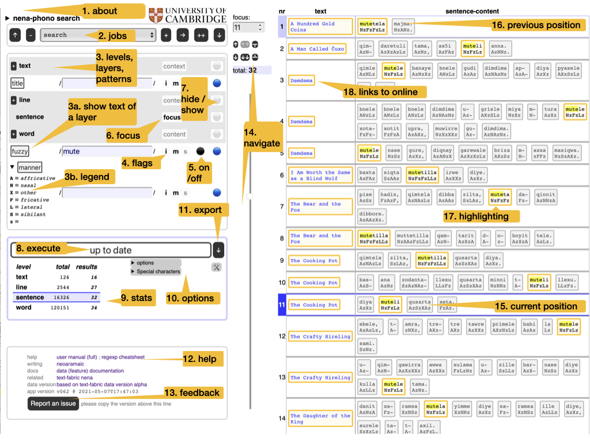
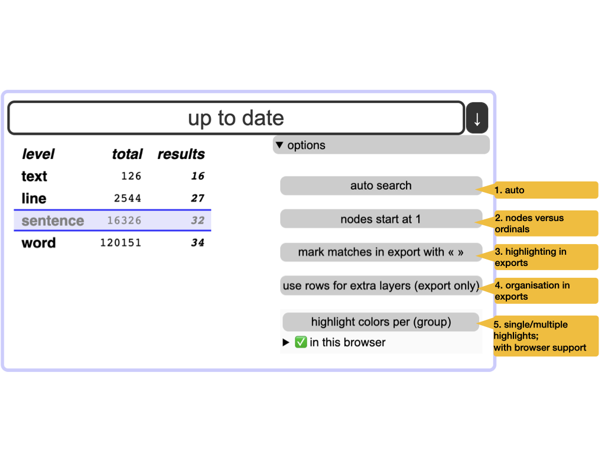
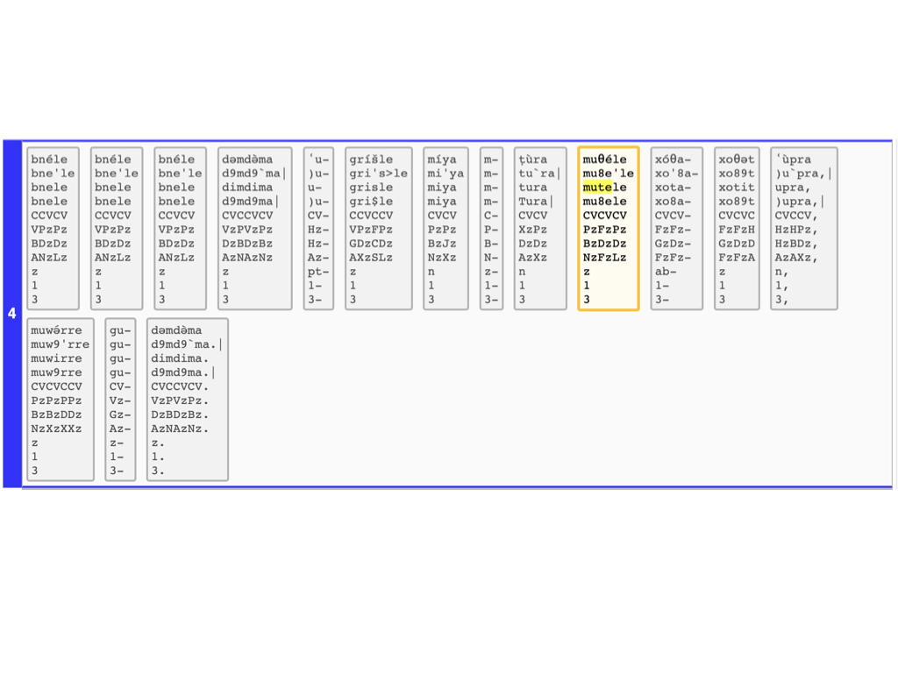
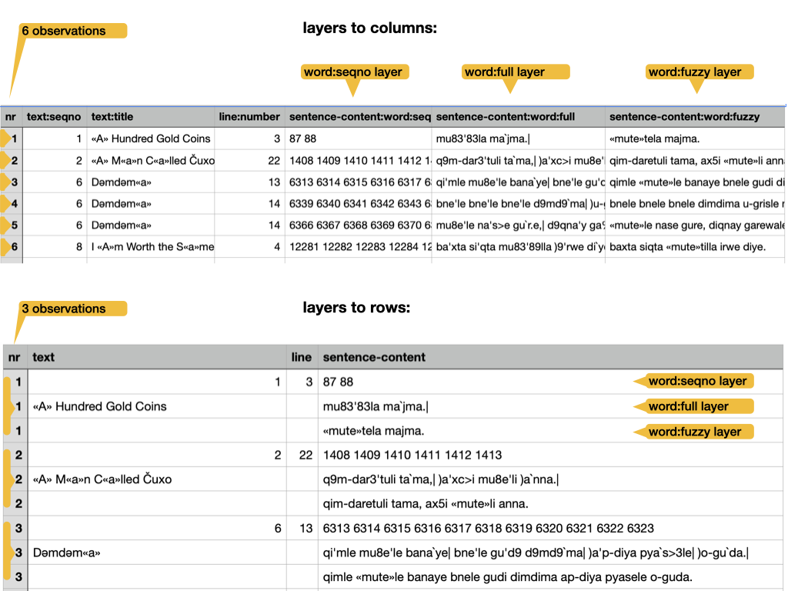
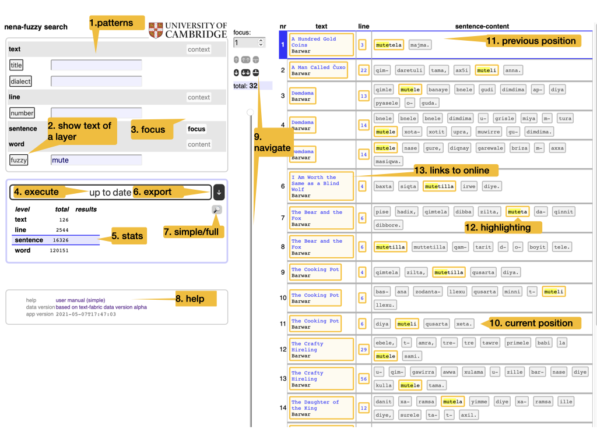

# Quick start




1.  **about** colofon, with provenance and license information

2.  **jobs** manage your search tasks. They are remembered by your browser. You can start new jobs,
    rename, duplicate and delete them. You can import jobs from file and export them to file.

    *Tip: use this when switching between browsers. That includes sharing jobs with other people.*

3.  **levels, layers, patterns** the corpus is represented in full text in several ways: the *layers*.
    They have been generated by choosing a *level* (such as text, line, word),
    and representing the objects of at level by some of their *features* (such as title,
    number, transcription). The resulting text of the layer can be searched by means of patterns,
    which are technically *regular expressions* (*regexes*).

    *Tip: read more about what you can do with regexes in the
    [Javascript documentation](https://developer.mozilla.org/en-US/docs/Web/JavaScript/Guide/Regular_Expressions/Cheatsheet).*

4.  **flags** when searching with regexes, you can alter their interpretation by means of setting some *flags*:
    *    **i**: case-insensitive;
    *    **m**: multiline (`^` and `$` match around embedded newlines);
    *    **s**: single-string (`.` also matches newlines).

5.  **on/off**: regexes can be switched of and on.

    *Tip: use this to explore the effect of individual regexes.*

6.  **focus**: the level that corresponds with a single row in the results table.

7.  **hide/show**: whether a layer/level should show up in the results.
    Showing a level means showing their objects by their unique node numbers or sequence numbers.

    *Tip: you can show layers in which you do not search, and hide layers in which you do search.*

8.  **execute**: press this to execute the current search job (again).

    *Tip: there is an option to do this automatically whenever you have changed something in the 
    search criteria.*

9.  **stats**: statistics of the current search results, compared to the statistics of the whole corpus.

10. **options**: modify the behaviour of search/export. See **Options** below.

11. **export**: export the search results as a tab-separated file (`.tsv`). This file can be opened
    in Excel.
    All  results are exported.
    The level of detail depends on the current **focus** and **hide/show**.

    *Tip: The precise organization of the export may depend on some of the options, see **Options** below.

12. **help**: various links to information that you frequently need: this help, the data features of the
    corpus, related corpus data.

13. **feedback**: a button to file an issue on GitHub; please copy and paste the version of this app
    in any issue you file.

14. **navigate**: walk through the results in various ways: manual entry of result number, small jumps
    back and forth, big strides with the slider.

    *Tip: use keyboard shortcuts, all shortcuts need `Alt+Shift` on Edge and Chrome and
    `Ctrl+Option` on Safari:*

    shortcut | direction | amount
    --- | --- | ---
    `m` | NA | manual entry of the result number
    `n` | **n**ext | one
    `p` | **p**revious | one
    `b` | **b**ack | a batch (half a screenful)
    `f` | **f**orward | a batch (half a screen)
    `s` | **s**tart | all the way
    `e` | **e**end | all the way
    
15. **position**: the current position in the results table is highlighted.

16. **previous position**: the previous position in the results table is also highlighted.

17. **highlighting**: the portions in the layer that match the corresponding regex are highlighted.

    *Tip: highlights are exported by enclosing the text in « and », but you can switch this of
    by means of an option. See **Options** below.*
    
## Options



1.  **auto** executes the search automatically whenever you have changed some criterion.
    Also updates the results when you have modified the focus and visibility of layers.

2.  **nodes versus ordinals** each object in the corpus has a unique number: its *node* number.
    Within a level, we can also enumerate all objects, starting with 1. The ordinals we get
    are identify objects uniquely within their level.
    You can choose wich of these numbers you want displayed.

    *Tip: use nodes for interoperability with Text-Fabric; otherwise ordinals are more intuitive.*

3.  **highlighting in exports** Highlighting information is a valuable outcome of a search.
    But in exports, the highlight characters « » may hinder further processing. So you
    can omit them.

4.  **organisation in exports** When several layers are visible for a level, the question arises:
    how should we export results? There are two options:
    *   use extra rows for the extra layers;
    *   use extra columns for the extra layers.

    You choose!

    *Tip: use extra rows if you rely on visual inspection of the exported file in Excel.
    Use extra columns if you want to process the exported file by means of other tools, such
    as Pandas or R.

5.  **single or multiple highlights** If you use `( )` in your regexes, the corresponding parts
    of the results can be highlighted with different colours, if you want.
    
    *Tip: Not all browsers support this, the interface shows whether your browser supports
    it, and which browsers do support it.*

    *Tip: This is handy for cases where you search for twice the same thing in a sentence, for instance.
    You can have both matches coloured differently.*
    

# Background information

Layered-search is a way of full-text searching your corpus by means of
[regular expressions](https://developer.mozilla.org/en-US/docs/Web/JavaScript/Guide/Regular_Expressions/Cheatsheet),
but with a twist to make use of the annotations made to items in the corpus at various levels.

## Corpus in layers

Your corpus is divided into levels, e.g. book/chapter/verse/sentence/word/line/letter.

At each level the items of corpus can be represented in certain ways:

* books are represented by book titles;
* chapters and verses are represented by their numbers;
* words and letters are represented by the strings of which they are composed.

Per level, there may be more than one way to represent the items.
For example, for the word level, you may have representations in the original script in unicode,
but also various transliterations in ascii.

All these representations are *layers* that you can search.
For example, the
[NENA corpus](https://github.com/CambridgeSemiticsLab/nena_tf)
contains various text representations, among which several are dedicated to phonetic
properties.



Layers do not have to correspond with the text of the corpus.
For example, you can make a layer where you put the part-of-speech of the
words after each other. You could then search for things like

```
(verb noun noun)+
```

We'll stick to NENA for examples of layered search.

## Combined search

In order to search, you specify search patterns for as many of
the available layers as you want.

When the search is performed, all these layers will produce results,
and the results per layer will be compared, and only results that
hold in all layers, filter through.

So, if you have specified 

level | layer | pattern
--- | --- | ---
**word** | **fuzzy** | `m[a-z]*t[a-z]*l`

you get all words with an `m`, `t`, and `l` in it, in that order.
There are 1338 such words in 1238 sentences.

By clicking on the checkbox next to the **full** layer,
you will see the full-ascii transliteration of these results as well.

You can specify an additional search in the **full** layer, for example
all words with a backquote \` in it. (A combining vowel diacritic).

level | layer | pattern
--- | --- | ---
**word** | **full** | \`
**word** | **fuzzy** | `m[a-z]*t[a-z]*l`

We then get the words that meet both criteria, still a good 492.

You can also constrain with other levels.
Suppose we want only occurrences of the previous results in texts
written at the place *Dure*.

level | layer | pattern
--- | --- | ---
**text** | **place** | `Dure`
**word** | **full** | \`
**word** | **fuzzy** | `m[a-z]*t[a-z]*l`

You can go even further, we want them in the first 3 lines of the texts:

level | layer | pattern
--- | --- | ---
**text** | **place** | `Dure`
**line** | **number** | `\b[1-3]\b`
**word** | **full** | \`
**word** | **fuzzy** | `m[a-z]*t[a-z]*l`

Still 20 results.

## Focus

The *focus level* is the level that corresponds to each individual result in the
results table. Higher levels are *context* levels, lower levels are *content* levels.

Each result consists of

*   the results in the context levels; 
*   the results in the focus level;
*   the contents of the results in the focus level, i.e. all objects in content levels
    that are contained in the focus results.

*Example:* if the **focus level** is `sentence`, then each result contains

*   the text in which the sentence occurs, represented by its layers that have been made visible;
*   the line in which the sentence occurs, represented by its layers that have been made visible;
*   the sentence itself, represented by its layers that have been made visible;
*   all words in the sentence, in each of their layers that have been made visible,
    conacatenated per layer, with the matching portions highlighted.

By varying the focus level, you can add more or less context for your search results.

## Results export

You can also export the search results to Excel (or rather, a tab-separated file, `.tsv`).
When you do that, *all* results will get exported, not only the ones that show
on the interface.

The organization of the exported results reflects the interface.
It makes sense to think of the rows as observations, and the columns as properties of those observations.

We may have issued multiple regexes to multiple layers, so we have to define our concept of observation.

The first clue is our **focus** setting: the focus level defines our unit of information.
If it is *sentence*, we observe sentences, and the rows in the results table correspond to
sentences.

The sentences have a context and they have content.

The context are the enclosing objects, such as lines and texts. So we will have columns for lines and texts
in our result row.

The content are the words in the sentences. So we will have a column for the words in our result row.

All this describes the case where we have chosen the sentence as focus level.
If instead we take the line as focus level, things shift.

Then the context is just the text level, and the content are the sentence and word levels.

Whatever we have chosen, we fill the columns with the appropriate objects.
Objects are represented by how they show up in the layers that have been selected for them.

What if multiple layers have been selected for objects?

Then we have a choice: use extra columns for those layers or use extra rows for those layers.
Both have advantages and disadvantages.

Here we show the difference.

### Extra columns



*   `+`: one result, one row, good for postprocessing
*   `-`: the layers  of one object do not line up, difficult visual inspection

### Extra rows



*   `-`: one result, multiple rows, complicates postprocessing
*   `+`: the layers  of one object line up, comfortable visual inspection

# The search interface as app

We have implemented layered search as an offline Single Page Application.

The app consists of a single HTML file (`index.html`),
a CSS file, PNG files (logos) and Javascript files.
The corpus data is in a big Javascript file, the corpus configuration in a small one.
The remaining Javascript files are the modules of the program.

Modern browsers can take in modular Javascript, except when you have the HTML file
locally on your computer and you open it with a double click.
Your browser has then `file://` in its URL bar, and in that cases modular Javascript does
not work.

To overcome that, we have also bundled the program in a single file, and that is included by
`local.html`.

From within the app, you can download a zip file with `local.html` in it,
so that you can have the full search experience completely off-line.

Also when you have opened this page over the internet, your browser has downloaded the
complete app, and all interaction between you and the search app happens at your browser,
without further internet connection (except when you navigate to links to the internet).

As a consequence

* this app works without any kind of installation
* it does not collect data about you
* it does not use cookies.
* it works without internet connection

When the browser remembers your previous jobs,
it does not use cookies for it but
[localStorage](https://developer.mozilla.org/en-US/docs/Web/API/Window/localStorage),
which other sites cannot read.

# Making this app

The construction of this app relies very much of the organization of the corpus
as a Text-Fabric dataset.

The layered search functionality is being baked into Text-Fabric.
That means that the designer of the search app only needs to specify the layers,
and write a small piece of code to generate the layers from the Text-Fabric dataset.

All the rest (building, shipping, and deploying the app) is then automatic.

We have created the first layered search interface for the 
[NENA](https://github.com/CambridgeSemiticsLab/nena_tf) corpus.

The designer needed to put some things in place in 
[app-nena/layeredsearch](https://github.com/annotation/app-nena/tree/master/layeredsearch),
and we built the app and deployed it by means of `tf.client.make`.

We intend to make such interfaces for other Text-Fabric corpora, streamlining the preparation
step in the process.

# Credits

The idea for this app came out of a discussion of
[Cody Kingham](https://www.linkedin.com/in/cody-kingham-1135018a)
and me about how we could
make a simple but usable search interface for people that need to get hand on with
the corpus in the first place.

Given that we have the corpus data at our finger tips through Text-Fabric,
but that TF-Query (`tf.about.searchusage`) does not cover over all use cases,
and requires installing Python and almost programming,
the approach is to assemble data and power a simple Javascript
program with it.

This implementation of the idea was funded by
[Prof. Geoffrey Khan](https://www.ames.cam.ac.uk/people/professor-geoffrey-khan),
and eventually written by
[Dirk Roorda](https://pure.knaw.nl/portal/en/persons/dirk-roorda).
